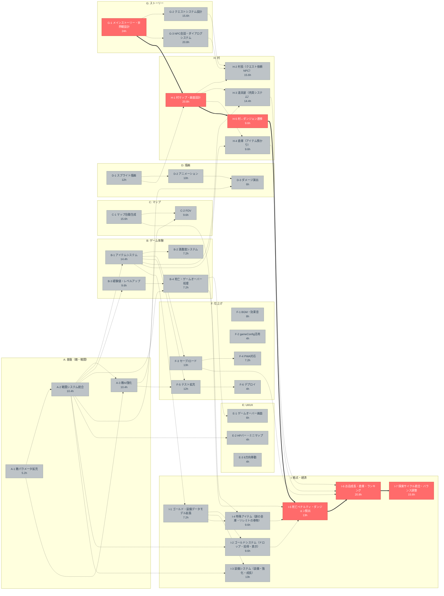

# クリティカルパス・依存関係図

## WBS

| タスクID | 機能       | タスク                                   | 依存関係           | 見積(h) | 係数 | 調整後(h) |
| -------- | ---------- | ---------------------------------------- | ------------------ | ------- | ---- | --------- |
| A-1      | 基盤       | 敵パラメータ拡充                         | -                  | 4       | 1.3  | 5.2       |
| A-2      | 基盤       | 戦闘システム統合                         | A-1                | 8       | 1.3  | 10.4      |
| A-3      | 基盤       | 敵AI強化                                 | A-1, A-2           | 8       | 1.3  | 10.4      |
| B-1      | ゲーム体験 | アイテムシステム                         | A-2                | 12      | 1.2  | 14.4      |
| B-2      | ゲーム体験 | 満腹度システム                           | B-1                | 6       | 1.2  | 7.2       |
| B-3      | ゲーム体験 | 経験値・レベルアップ                     | A-2                | 8       | 1.2  | 9.6       |
| B-4      | ゲーム体験 | 死亡・ゲームオーバー処理                 | A-2, B-3           | 6       | 1.2  | 7.2       |
| C-1      | マップ     | マップ自動生成                           | -                  | 12      | 1.3  | 15.6      |
| C-2      | マップ     | FOV                                      | C-1, A-3           | 8       | 1.2  | 9.6       |
| D-1      | 描画       | スプライト描画                           | -                  | 12      | 1    | 12        |
| D-2      | 描画       | アニメーション                           | D-1                | 10      | 1    | 10        |
| D-3      | 描画       | ダメージ演出                             | D-2, A-2           | 6       | 1    | 6         |
| E-1      | UI/UX      | ゲームオーバー画面                       | B-4                | 6       | 1    | 6         |
| E-2      | UI/UX      | HPバー・ミニマップ                       | A-2                | 4       | 1    | 4         |
| E-3      | UI/UX      | 8方向移動                                | -                  | 4       | 1    | 4         |
| F-1      | 仕上げ     | BGM・効果音                              | -                  | 8       | 1    | 8         |
| F-2      | 仕上げ     | gameConfig活用                           | -                  | 4       | 1    | 4         |
| F-3      | 仕上げ     | セーブ/ロード                            | B-1                | 10      | 1.3  | 13        |
| F-4      | 仕上げ     | PWA対応                                  | F-3                | 6       | 1.2  | 7.2       |
| F-5      | 仕上げ     | テスト拡充                               | A-3, B-1           | 12      | 1    | 12        |
| F-6      | 仕上げ     | デプロイ                                 | F-5                | 4       | 1    | 4         |
| G-1      | ストーリー | メインストーリー・世界観設計             | -                  | 16      | 1.5  | 24        |
| G-2      | ストーリー | クエストシステム設計                     | G-1                | 12      | 1.3  | 15.6      |
| G-3      | ストーリー | NPC会話・ダイアログシステム              | G-1                | 16      | 1.3  | 20.8      |
| H-1      | 村         | 村マップ・画面設計                       | G-1, D-1           | 16      | 1.3  | 20.8      |
| H-2      | 村         | 村長（クエスト依頼NPC）                  | H-1, G-2, G-3      | 12      | 1.3  | 15.6      |
| H-3      | 村         | 道具屋（売買システム）                   | H-1, B-1           | 12      | 1.2  | 14.4      |
| H-4      | 村         | 倉庫（アイテム預かり）                   | H-1, B-1           | 8       | 1.2  | 9.6       |
| H-5      | 村         | 村⇔ダンジョン遷移                        | H-1                | 8       | 1.2  | 9.6       |
| I-1      | 拠点・経済 | ゴールド・装備データモデル拡張           | B-1                | 6       | 1.2  | 7.2       |
| I-2      | 拠点・経済 | ゴールドシステム（ドロップ・拾得・表示） | I-1, A-2           | 8       | 1.2  | 9.6       |
| I-3      | 拠点・経済 | 装備システム（装備・強化・成長）         | I-1, A-2           | 10      | 1.3  | 13        |
| I-4      | 拠点・経済 | 特殊アイテム（謎の金庫・リレミトの巻物） | I-1, C-1           | 8       | 1.2  | 9.6       |
| I-5      | 拠点・経済 | 死亡ペナルティ・ダンジョン脱出           | I-2, I-4, B-4, H-5 | 10      | 1.3  | 13        |
| I-6      | 拠点・経済 | お店成長・倉庫・ランキング               | I-5, H-3, H-4, F-3 | 16      | 1.3  | 20.8      |
| I-7      | 拠点・経済 | 探索サイクル統合・バランス調整           | I-6                | 12      | 1.3  | 15.6      |

## 依存関係図（クリティカルパス強調）



## クリティカルパス（最長経路: 103.8h）

```text
G-1 メインストーリー・世界観設計 (24h)
 → H-1 村マップ・画面設計 (20.8h)
  → H-5 村⇔ダンジョン遷移 (9.6h)
   → I-5 死亡ペナルティ・ダンジョン脱出 (13h)
    → I-6 お店成長・倉庫・ランキング (20.8h)
     → I-7 探索サイクル統合・バランス調整 (15.6h)
```

## 凡例

| 色        | 意味                                           |
| --------- | ---------------------------------------------- |
| 赤        | クリティカルパス（遅延でプロジェクト全体遅延） |
| グレー    | 並行可能タスク                                 |
| ==> 太線  | クリティカルパス上の依存                       |
| -.-> 破線 | その他の依存                                   |
