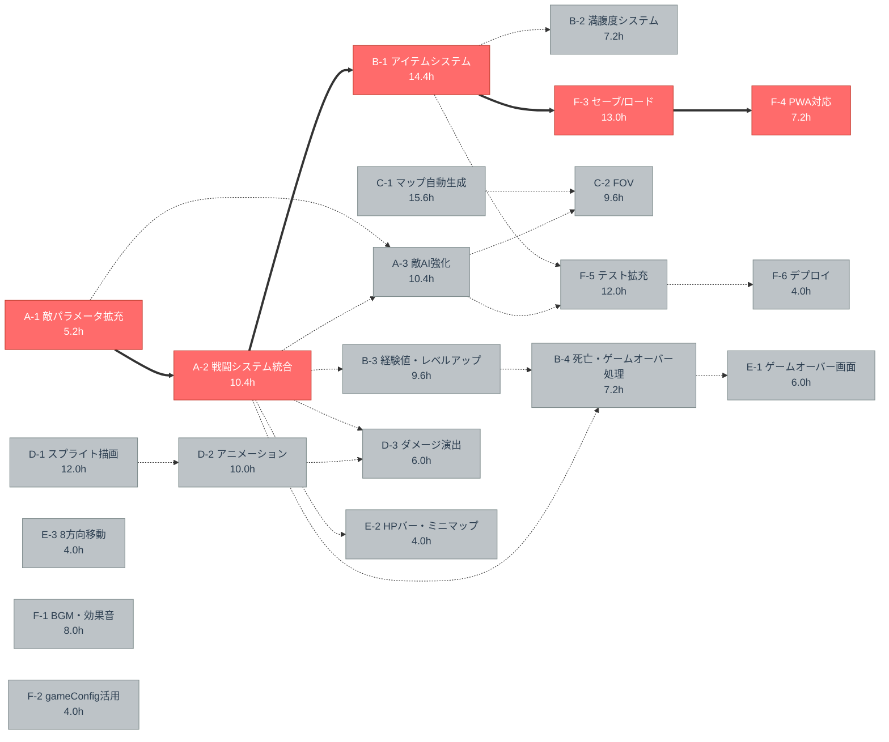

# クリティカルパス・依存関係図

## WBS

| タスクID | 機能 | タスク | 依存関係 | 見積(h) | 係数 | 調整後(h) |
| -------- | ---- | ------ | -------- | ------- | ---- | --------- |
| A-1 | 基盤 | 敵パラメータ拡充 | - | 4 | 1.3 | 5.2 |
| A-2 | 基盤 | 戦闘システム統合 | A-1 | 8 | 1.3 | 10.4 |
| A-3 | 基盤 | 敵AI強化 | A-1, A-2 | 8 | 1.3 | 10.4 |
| B-1 | ゲーム体験 | アイテムシステム | A-2 | 12 | 1.2 | 14.4 |
| B-2 | ゲーム体験 | 満腹度システム | B-1 | 6 | 1.2 | 7.2 |
| B-3 | ゲーム体験 | 経験値・レベルアップ | A-2 | 8 | 1.2 | 9.6 |
| B-4 | ゲーム体験 | 死亡・ゲームオーバー処理 | A-2, B-3 | 6 | 1.2 | 7.2 |
| C-1 | マップ | マップ自動生成 | - | 12 | 1.3 | 15.6 |
| C-2 | マップ | FOV（視界） | C-1, A-3 | 8 | 1.2 | 9.6 |
| D-1 | 描画 | スプライト描画 | - | 12 | 1.0 | 12.0 |
| D-2 | 描画 | アニメーション | D-1 | 10 | 1.0 | 10.0 |
| D-3 | 描画 | ダメージ演出 | D-2, A-2 | 6 | 1.0 | 6.0 |
| E-1 | UI/UX | ゲームオーバー・クリア画面 | B-4 | 6 | 1.0 | 6.0 |
| E-2 | UI/UX | HPバー・ミニマップ | A-2 | 4 | 1.0 | 4.0 |
| E-3 | UI/UX | 8方向移動 | - | 4 | 1.0 | 4.0 |
| F-1 | 仕上げ | BGM・効果音 | - | 8 | 1.0 | 8.0 |
| F-2 | 仕上げ | gameConfig.json活用 | - | 4 | 1.0 | 4.0 |
| F-3 | 仕上げ | セーブ/ロード | B-1 | 10 | 1.3 | 13.0 |
| F-4 | 仕上げ | PWA対応 | F-3 | 6 | 1.2 | 7.2 |
| F-5 | 仕上げ | テスト拡充 | A-3, B-1 | 12 | 1.0 | 12.0 |
| F-6 | 仕上げ | デプロイ | F-5 | 4 | 1.0 | 4.0 |

## 依存関係図（クリティカルパス強調）



## クリティカルパス（最長経路: 50.2h）

```text
A-1 敵パラメータ拡充 (5.2h)
 → A-2 戦闘システム統合 (10.4h)
  → B-1 アイテムシステム (14.4h)
   → F-3 セーブ/ロード (13.0h)
    → F-4 PWA対応 (7.2h)
```

## 凡例

| 色 | 意味 |
|----|------|
| 赤 | クリティカルパス（遅延 → プロジェクト全体遅延） |
| グレー | 並行可能タスク |
| `==>` 太線 | クリティカルパス上の依存 |
| `-.->` 破線 | その他の依存 |
