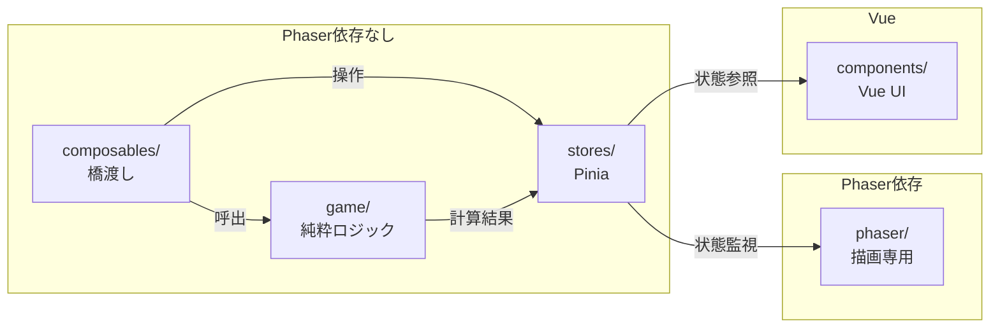
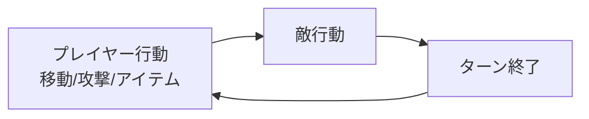
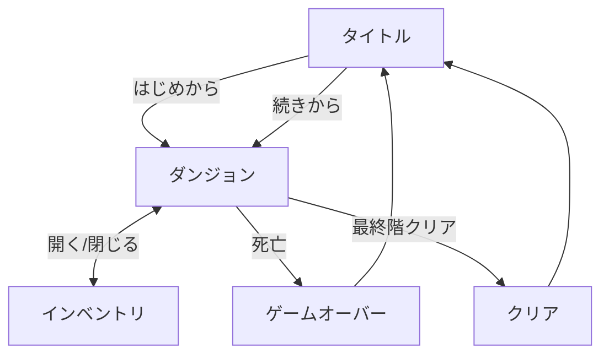
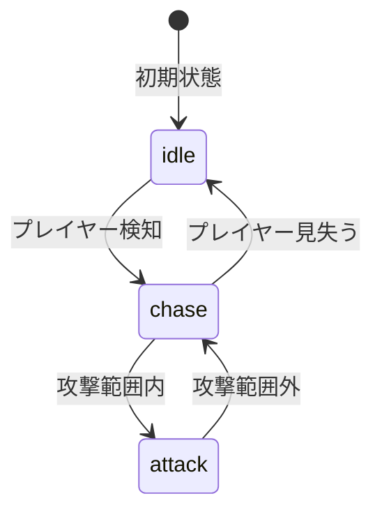

# ローグライクゲーム開発 仕様書

## 1. プロジェクト概要

### コンセプト

「不思議のダンジョン」風のターン制ローグライクゲーム（プロトタイプ版）

### ターゲット

- プラットフォーム: スマートフォン（Webブラウザ）
- 対象: プライベート利用

### 規模

- 小規模プロトタイプ
- 5-10階層の固定ダンジョン
- 基本機能のみ実装

---

## 2. 技術スタック（決定）

### 採用構成: Nuxt 3 + Phaser 3

| レイヤー | 技術 | 理由 |
| --- | --- | --- |
| フレームワーク | Nuxt 3 | 慣れている、Pinia統合、開発効率 |
| ゲーム描画 | Phaser 3 | 情報多い、音声等すぐ使える |
| 状態管理 | Pinia | 状態の一元管理、カオス防止 |
| ダンジョン生成 | rot.js | FOV、パス探索、将来のランダム生成（導入済み・未使用） |
| 言語 | TypeScript | 型安全性 |
| UI装飾 | NES.css | タイトル画面のレトロUI |
| PWA | @vite-pwa/nuxt | オフライン対応（未導入） |

### 選定理由

1. Nuxtに慣れている → 迷いが減る
2. Piniaで状態管理が明確 → ゲーム状態が散らばらない
3. Phaserの情報が多い → AI実装時に正確なコードが出やすい
4. ロジックと描画を分離 → カオス防止

---

## 3. アーキテクチャ（カオス防止設計）

### ディレクトリ構成

```text
roguelike/
├── stores/                   # Pinia（状態の単一ソース）
│   └── gameStore.ts          # 全ゲーム状態を一元管理
│
├── game/                     # 純粋なゲームロジック（Phaser非依存）
│   ├── entities/
│   │   ├── Player.ts         # プレイヤーデータ・ロジック
│   │   └── Enemy.ts          # 敵データ・ロジック・定義
│   ├── systems/
│   │   ├── TurnManager.ts    # ターン処理
│   │   └── CombatSystem.ts   # ダメージ計算
│   └── data/
│       └── gameConfig.json   # ゲーム設定パラメータ
│
├── phaser/                   # Phaser描画層
│   └── scenes/
│       ├── DungeonScene.ts   # ダンジョン描画・入力処理
│       └── UIScene.ts        # HUD・コントローラー描画
│
├── components/               # Vue UI
│   └── GameCanvas.client.vue # Phaser埋め込み
│
└── pages/
    ├── index.vue             # タイトル
    └── game.vue              # ゲーム画面
```

> **未作成ファイル（今後実装予定）:**
> `composables/`（useGameState, useTurnSystem, useCombat, useInventory）、
> `game/entities/Item.ts`、`game/systems/AISystem.ts`、`game/data/maps/`、
> `phaser/sprites/CharacterSprite.ts`、
> `components/Inventory.vue`、`components/TouchControls.vue`

### 分離ルール

| 層             | 責務           | Phaser依存 |
| -------------- | -------------- | ---------- |
| `game/`        | 計算・ロジック | ❌ なし    |
| `stores/`      | 状態保持       | ❌ なし    |
| `composables/` | ロジック橋渡し | ❌ なし    |
| `phaser/`      | 描画のみ       | ✅ あり    |
| `components/`  | Vue UI         | ❌ なし    |

### データフロー



### 設計原則

1. **game/は純粋なTypeScript** - Phaserを一切使わない、テスト可能
2. **Pinia一元管理** - 状態変更は必ず`stores/gameStore.ts`経由
3. **Phaserは描画専用** - storeを監視して描画するだけ
4. **1ファイル1責務** - 機能を分散させない

> **現状の課題:** DungeonScene.tsがプレイヤー位置を直接管理しており、
> Pinia storeと未連携。UIScene.tsのステータス更新メソッドもstore未監視。
> 原則2・3の完全適用は今後の課題。

---

## 4. ゲーム仕様

### 4.1 基本システム

#### ターン制

- 1ターン = 1行動（移動、攻撃、アイテム使用など）



#### 移動

- 8方向移動（上下左右＋斜め）
- グリッドベース（タイル単位）

#### 視界

- プレイヤー周囲のみ表示（FOV）
- 一度見た場所は暗く表示（探索済み）

#### 描画方式

- **トップダウン＋立体壁**（見下ろし視点、壁に高さ表現あり）
- タイルは正方形グリッド（16×16ベース、4倍拡大で64×64表示）
- 壁はビットマスク判定で前面・側面・上端を描画し立体感を表現
- 参考: 不思議のダンジョンシリーズ（トルネコ、シレン等）

### 4.2 ダンジョン

#### 構成（プロトタイプ）

- 固定マップ（5-10階層）
- 部屋 + 通路の構成
- 階段で次の階へ

#### タイル種類

| タイル   | 説明     |
| -------- | -------- |
| 床       | 移動可能 |
| 壁       | 移動不可 |
| 階段     | 次の階へ |
| アイテム | 拾える   |

### 4.3 キャラクター

#### プレイヤー

| パラメータ | 初期値 |
| ---------- | ------ |
| HP         | 100    |
| 攻撃力     | 10     |
| 防御力     | 5      |

#### 敵（プロトタイプは1-2種類）

| 名前     | HP  | 攻撃力 | 行動パターン |
| -------- | --- | ------ | ------------ |
| スライム | 20  | 5      | 隣接時攻撃   |
| ゴブリン | 30  | 8      | 追跡して攻撃 |

### 4.4 アイテム（プロトタイプは最小限）

| アイテム | 効果         |
| -------- | ------------ |
| 回復草   | HP +30       |
| 毒消し草 | 状態異常回復 |

### 4.5 操作方法

#### キーボード操作

- WASD / 矢印キー（4方向移動）

#### タッチ操作

- 仮想方向パッド（8方向）
- A/Bボタン（決定/待機）
- L/Rボタン（アイテム切り替え）
- SELECT/STARTボタン（インベントリ/メニュー）

#### UI配置

```text
┌─────────────────────────┐
│  [階層 Lv HP 満腹度]    │
├─────────────────────────┤
│      ゲーム画面          │
│                         │
│                         │
├─────────────────────────┤
│  [メッセージログ 2行]    │
├─────────────────────────┤
│  [L]              [R]   │
│  ↖ ↑ ↗        [A]     │
│  ← · →                 │
│  ↙ ↓ ↘        [B]     │
│    [SELECT] [START]     │
└─────────────────────────┘
```

---

## 5. アセット仕様

### 5.1 アセット管理方法

`public/assets/asset-pack.json`で一括管理する予定（未実装、現在はDungeonScene.tsで個別ロード）：

```json
{
  "section": [
    {
      "files": [
        { "type": "image", "key": "player_down", "url": "sprites/player_down.png" },
        { "type": "image", "key": "tileset", "url": "tiles/dungeon.png" },
        { "type": "audio", "key": "bgm", "url": "audio/dungeon.mp3" }
      ]
    }
  ]
}
```

Phaserで一括読み込み：

```typescript
this.load.pack('assets', 'assets/asset-pack.json')
```

### 5.2 アセットディレクトリ構成

現在の実際のディレクトリ構成:

```text
public/assets/
└── tiles/                              # 全タイル・スプライト
    ├── floor_1.png 〜 floor_8.png      # 床バリエーション
    ├── floor_stairs.png                # 階段
    ├── wall_mid.png 等                 # 壁タイル（前面・側面・上端・角等 多数）
    ├── knight_m_idle_anim_f0〜f3.png   # プレイヤー待機（男性）
    ├── knight_m_run_anim_f0〜f3.png    # プレイヤー移動（男性）
    ├── knight_f_idle_anim_f0〜f3.png   # プレイヤー待機（女性）
    └── knight_f_run_anim_f0〜f3.png    # プレイヤー移動（女性）
```

> **今後追加予定のディレクトリ:** `sprites/`（敵）、`items/`、`ui/`、`audio/`、`fonts/`

### 5.3 必要アセット一覧（最小構成）

| カテゴリ | 数量 | 内容 | サイズ |
| --- | --- | --- | --- |
| フォント | 1 | ピクセルフォント | - |
| タイルセット | 多数 | 床8種・壁多数・階段（個別PNG） | 16x16/タイル |
| プレイヤー | 16枚 | 男女×待機・移動 各4フレーム | 16x16 |
| 敵（スライム） | 2枚 | 待機・攻撃（未作成） | 16x16 |
| 敵（ゴブリン） | 2枚 | 待機・攻撃（未作成） | 16x16 |
| アイテム | 4枚 | 回復草、毒消し草、巻物、食料（未作成） | 16x16 |
| UI | - | Phaser Graphicsで描画（画像不使用） | - |
| 効果音 | 6個 | 攻撃、被ダメ、回復、階段、拾う、死亡（未作成） | - |
| BGM | 1曲 | ダンジョン用ループ（未作成） | - |

現状: タイル・スプライト約50ファイル作成済み。敵・アイテム・音声は未作成。

### 5.4 仮素材での開発

初期は以下の方法で進める：

1. ~~**図形で代用**: Phaserの`Graphics`で四角・丸を描画~~ → フリー素材のスプライトタイル（16×16）を使用中
2. **フリー素材サイト**:
   - [itch.io](https://itch.io/game-assets/free/tag-roguelike)
   - [OpenGameArt](https://opengameart.org/)
3. **後でStable Diffusionで生成**して差し替え

### 5.5 Stable Diffusion ワークフロー（後で実施）

#### 推奨モデル

- Pixel Art Sprite Diffusion（Civitai）
- All-In-One-Pixel-Model（Hugging Face）

#### プロンプト例

```text
8-bit pixel art, RPG character, warrior with axe,
front view, transparent background, sprite sheet style,
32x32 pixels, NES color palette
```

#### 後処理

1. 生成 → 手直し（Aseprite）
2. 背景透過
3. スプライトシート化

### 5.6 音声

| 種類 | 数量  | 内容                                             |
| ---- | ----- | ------------------------------------------------ |
| BGM  | 1-2曲 | ダンジョン、タイトル                             |
| SE   | 6個   | 攻撃、被ダメージ、回復、階段、アイテム拾う、死亡 |

フリー素材サイト:

- [魔王魂](https://maou.audio/)
- [効果音ラボ](https://soundeffect-lab.info/)

---

## 6. 画面構成

### 6.1 画面一覧

| 画面           | 説明                 |
| -------------- | -------------------- |
| タイトル       | ゲーム開始、続きから |
| ダンジョン     | メインゲーム画面     |
| インベントリ   | アイテム管理         |
| ゲームオーバー | 死亡時               |
| クリア         | 最終階クリア時       |

### 6.2 画面遷移



---

## 7. データ設計

### 7.1 セーブデータ

```typescript
interface SaveData {
  player: {
    hp: number
    maxHp: number
    attack: number
    defense: number
    position: { x: number; y: number }
    inventory: Item[]
  }
  dungeon: {
    floor: number
    map: number[][]
    enemies: Enemy[]
    items: Item[]
  }
}
```

### 7.2 保存先

- IndexedDB（PWA対応）
- localStorage（フォールバック）

---

## 8. 開発フェーズ

### Phase 1: 基盤構築

- [x] Nuxt 3プロジェクトセットアップ
- [x] Phaser 3 / rot.js / Pinia 導入（rot.jsは未使用）
- [x] 入力→描画の基本フロー実装（ターン制ゲームループは未統合）
- [x] ディレクトリ構成の整備
- [x] Docker開発環境構築

### Phase 2: ダンジョン実装

- [x] 固定マップの描画（フリー素材スプライトタイル使用）
- [x] 壁の立体表現描画システム（ビットマスク判定、タイルは1:1比率）
- [x] タイル管理システム（床8種、壁多数、階段表示のみ）
- [ ] FOV（視界）実装（rot.js）

### Phase 3: キャラクター実装

- [x] プレイヤー移動（キーボード4方向、タッチDPad8方向）
- [ ] ターン制システム（TurnManager.tsクラス作成済み、ゲーム未統合）
- [ ] 敵AI（Enemy.tsクラス作成済み、AISystem.ts未作成、描画・配置未実装）

### Phase 4: ゲームシステム

- [ ] 戦闘システム（CombatSystem.tsクラス作成済み、ゲーム未統合）
- [ ] アイテムシステム（gameConfig.jsonに定義のみ、Item.ts未作成）
- [ ] 階層移動（階段タイル表示済み、踏んでもログ出力のみ）

### Phase 5: UI/UX

- [x] タイトル画面
- [x] ステータスバー（階層、Lv、HP、満腹度）※描画済み、store未連携で値は静的
- [x] メッセージログ表示（2行表示、アクション時にメッセージ追加）
- [x] スマホタッチ操作（DPad8方向・A/B/L/R/SELECT/START実装済み、一部アクション未実装）
- [ ] インベントリ画面
- [ ] ゲームオーバー画面

### Phase 6: アセット

- [ ] Stable Diffusionでドット絵生成
- [ ] スプライトシート作成
- [ ] ゲームに組み込み

### Phase 7: 仕上げ

- [ ] PWA対応
- [ ] セーブ/ロード
- [ ] デバッグ、調整

---

## 9. AI実装時のガイドライン

### スコープを限定した指示例

```text
「game/systems/CombatSystem.tsにダメージ計算ロジックを実装して。
Phaserは使わず、純粋なTypeScriptで。
入力: attacker, defender
出力: ダメージ値」
```

```text
「stores/gameStore.tsにプレイヤー移動のactionを追加して。
移動可能かどうかのチェックはgame/systems/MovementSystem.tsを呼び出す形で」
```

### ルール

1. 1ファイル1責務を守る
2. Phaser依存コードはphaser/ディレクトリのみ
3. 状態変更は必ずPinia経由
4. ロジックはgame/ディレクトリに集約

---

## 10. 既存プロジェクトから学ぶエッセンス

### 10.1 アセット構成（参考）

既存の2Dアクションゲームのアセット構成：

| カテゴリ     | 数量 | 内容                                     |
| ------------ | ---- | ---------------------------------------- |
| フォント     | 1    | ピクセルアート用フォント                 |
| タイルマップ | 1    | Tiled JSON形式                           |
| タイルセット | 1    | 地形画像                                 |
| 背景         | 2    | 視差スクロール用                         |
| キャラクター | 20   | プレイヤー8種×2フレーム、敵4種×2フレーム |
| 装飾         | 9    | 木、岩、茂みなど                         |
| エフェクト   | 2    | ダスト、特殊効果                         |
| 効果音       | 10   | アクション音                             |
| BGM          | 1    | ループ音楽                               |

**ローグライク用に必要なアセット（最小構成）:**

| カテゴリ     | 数量 | 内容                                       |
| ------------ | ---- | ------------------------------------------ |
| フォント     | 1    | ピクセルアート用                           |
| タイルセット | 1    | 床、壁、階段（32x32推奨）                  |
| プレイヤー   | 4-8  | 4方向×待機/移動                            |
| 敵           | 2-4  | 種類×2フレーム                             |
| アイテム     | 4-6  | 草、巻物など                               |
| UI           | 5    | HPバー、ボタン、フレーム                   |
| 効果音       | 6    | 攻撃、ダメージ、回復、階段、アイテム、死亡 |
| BGM          | 1-2  | ダンジョン、タイトル                       |

### 10.2 設定ファイル設計（参考）

既存プロジェクトのgameConfig.json構造：

```json
{
  "screenSize": { "width": 1152, "height": 768 },
  "debugConfig": { "debug": false },
  "renderConfig": { "pixelArt": true },
  "playerConfig": {
    "walkSpeed": 260,
    "maxHealth": 100,
    "invulnerableTime": 2000
  },
  "enemyConfig": {
    "walkSpeed": 120,
    "maxHealth": 40,
    "detectionRange": 300,
    "patrolDistance": 200
  }
}
```

**ローグライク用に拡張（`game/data/gameConfig.json`として作成済み、コードからは未読み込み）:**

```json
{
  "screenSize": { "width": 480, "height": 720 },
  "tileSize": 32,
  "debugConfig": { "showFOV": false, "showGrid": false },
  "playerConfig": {
    "maxHealth": 100,
    "attack": 10,
    "defense": 5,
    "viewRange": 6
  },
  "enemyTypes": {
    "slime": { "maxHealth": 20, "attack": 5, "exp": 10 },
    "goblin": { "maxHealth": 30, "attack": 8, "exp": 20 }
  },
  "itemTypes": {
    "healingGrass": { "healAmount": 30 },
    "antidoteGrass": { "curePoison": true }
  },
  "dungeonConfig": {
    "floorsTotal": 10,
    "enemiesPerFloor": [3, 4, 5, 6, 7, 8, 9, 10, 12, 15]
  }
}
```

> **注意:** `tileSize: 32`はgameConfig.json上の値。DungeonScene.tsでは`baseTileSize = 16`（×4倍拡大=64px）をハードコードしており、このJSONは現在読み込まれていない。

### 10.3 活用すべき設計パターン

#### 1. 状態機械パターン（敵AI）



実装例（既存プロジェクトのSoundNinja.jsより）:

```typescript
aiState: 'patrol' | 'chase' | 'attack'

switch (this.aiState) {
  case 'patrol':
    // 一定範囲を往復
    if (distanceToPlayer <= detectionRange) {
      this.aiState = 'chase'
    }
    break
  case 'chase':
    // プレイヤーを追跡
    if (distanceToPlayer <= attackRange) {
      this.aiState = 'attack'
    }
    break
}
```

#### 2. ダメージフィードバック

```typescript
// 既存プロジェクトのKakashiPlayer.jsより
takeDamage(damage) {
  this.health -= damage
  this.showDamageNumber(damage)  // 数字表示
  this.playHurtSound()           // 効果音
  this.startBlinkEffect()        // 点滅
  this.setInvulnerable(2000)     // 無敵時間
}
```

#### 3. UIシーン分離

```typescript
// 既存プロジェクトのUIScene.jsより
// ゲームシーンと並行実行、独立したUI更新
update() {
  const gameScene = this.scene.get('DungeonScene')
  if (gameScene?.player) {
    this.updateHealthBar(gameScene.player.health)
  }
}
```

#### 4. 基底クラスによる継承

```typescript
// 既存プロジェクトのBaseLevelScene.jsより
class BaseLevelScene {
  // 共通処理
  setupCollisions()
  setupInputs()
  baseUpdate()
}

class Level1Scene extends BaseLevelScene {
  // レベル固有の実装
}
```

### 10.4 ローグライクへの適用

| 既存パターン           | ローグライクでの活用           |
| ---------------------- | ------------------------------ |
| 状態機械（敵AI）       | ターン制AI（待機→移動→攻撃）   |
| ダメージフィードバック | ダメージ数字、効果音、画面効果 |
| UIシーン分離           | HP、インベントリ、ミニマップ   |
| 基底クラス継承         | 敵種類の量産、ダンジョン層生成 |
| gameConfig.json        | 敵パラメータ、難易度調整       |
| asset-pack.json        | アセット一括管理、動的ロード   |

---

## 11. デプロイ（AWS Amplify）

### 11.1 Amplify設定

#### amplify.yml（ビルド設定）

```yaml
version: 1
frontend:
  phases:
    preBuild:
      commands:
        - npm install
    build:
      commands:
        - npm run generate
  artifacts:
    baseDirectory: .output/public
    files:
      - '**/*'
  cache:
    paths:
      - node_modules/**/*
      - .nuxt/**/*
```

#### 環境変数

```text
NODE_VERSION=18
NUXT_PUBLIC_AD_CLIENT=ca-pub-xxxxxxxxxx
```

### 11.2 デプロイ手順

1. GitHubにリポジトリをプッシュ
2. AWS Amplify Consoleで「新しいアプリをホスト」
3. GitHubリポジトリを選択
4. ビルド設定を確認（自動検出 or amplify.yml）
5. 環境変数を設定
6. デプロイ実行

### 11.3 カスタムドメイン（オプション）

- Amplify Consoleでドメイン管理
- SSL証明書は自動発行

---

## 12. 広告・収益化

### 12.1 広告配置方針

| 配置場所       | 広告タイプ           | タイミング               |
| -------------- | -------------------- | ------------------------ |
| タイトル画面   | バナー広告           | 常時表示                 |
| ゲームオーバー | インタースティシャル | 死亡時                   |
| 階層クリア     | リワード広告（任意） | クリア時に報酬と引き換え |
| インベントリ   | バナー広告（小）     | 開いている間             |

### 12.2 Google AdSense / AdMob

#### Nuxtでの実装

```typescript
// nuxt.config.ts
export default defineNuxtConfig({
  app: {
    head: {
      script: [
        {
          src: 'https://pagead2.googlesyndication.com/pagead/js/adsbygoogle.js',
          async: true,
          crossorigin: 'anonymous',
          'data-ad-client': 'ca-pub-xxxxxxxxxx',
        },
      ],
    },
  },
})
```

#### 広告コンポーネント

```vue
<!-- components/AdBanner.client.vue -->
<template>
  <ins
    class="adsbygoogle"
    style="display:block"
    :data-ad-client="adClient"
    :data-ad-slot="adSlot"
    data-ad-format="auto"
    data-full-width-responsive="true"
  >
  </ins>
</template>

<script setup>
  const adClient = useRuntimeConfig().public.adClient
  const props = defineProps(['adSlot'])

  onMounted(() => {
    ;(window.adsbygoogle = window.adsbygoogle || []).push({})
  })
</script>
```

### 12.3 リワード広告（ゲーム連携）

```typescript
// composables/useRewardAd.ts
export const useRewardAd = () => {
  const showRewardAd = async (): Promise<boolean> => {
    // 広告表示 → 視聴完了で true を返す
    return new Promise((resolve) => {
      // AdMob リワード広告のロジック
      // 視聴完了: resolve(true)
      // スキップ/エラー: resolve(false)
    })
  }

  const grantReward = () => {
    // 報酬付与（HP回復、アイテムなど）
    const gameStore = useGameStore()
    gameStore.player.hp = Math.min(gameStore.player.hp + 30, gameStore.player.maxHp)
  }

  return { showRewardAd, grantReward }
}
```

### 12.4 広告表示ルール

- **ゲームプレイ中は広告を表示しない**（没入感維持）
- ゲームオーバー広告は**3回に1回**程度に抑える
- リワード広告は**任意視聴**（強制しない）
- 広告読み込み失敗時は**スキップ可能**にする

### 12.5 収益化の注意点

- AdSense審査には**プライバシーポリシー**が必要
- ゲームコンテンツが**著作権侵害でないこと**を確認
- **過度な広告表示**はユーザー離脱の原因になる

---

## 13. 決定事項まとめ

| 項目           | 決定                                                             |
| -------------- | ---------------------------------------------------------------- |
| 技術スタック   | Nuxt 3 + Phaser 3 + Pinia + rot.js                               |
| ダンジョン     | 固定マップで開始                                                 |
| アセット       | 仮素材で進める、後でStable Diffusion                             |
| アーキテクチャ | ロジック/描画分離、Pinia一元管理                                 |
| 設計パターン   | 状態機械、ダメージフィードバック、UI分離、基底クラス継承         |
| 設定ファイル   | gameConfig.jsonでパラメータ外部化                                |
| デプロイ       | AWS Amplify（GitHub連携）                                        |
| 収益化         | Google AdSense / AdMob（バナー、インタースティシャル、リワード） |
